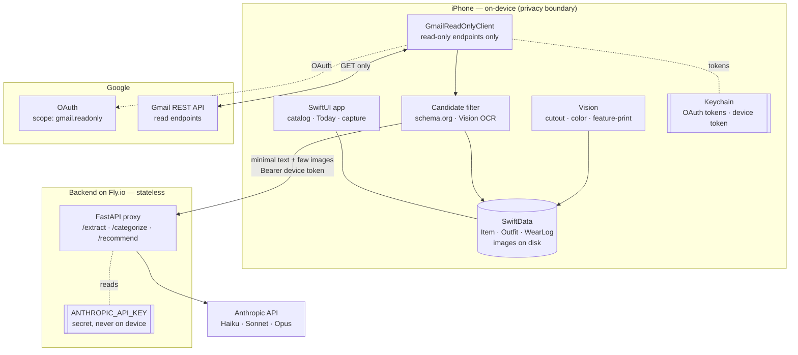
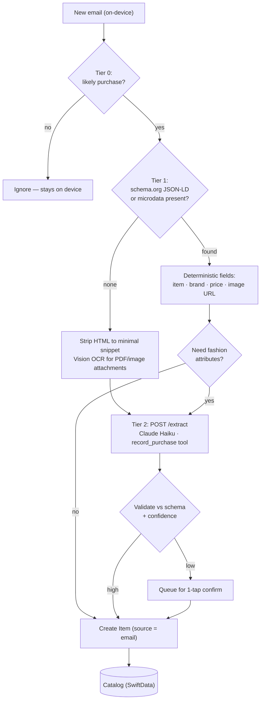
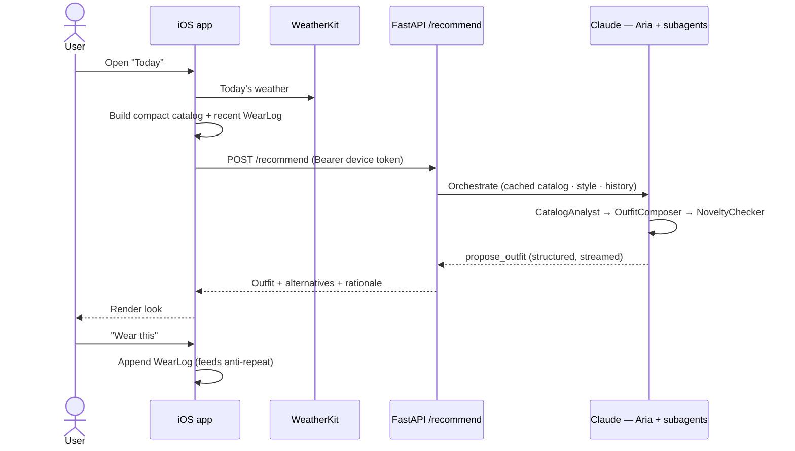
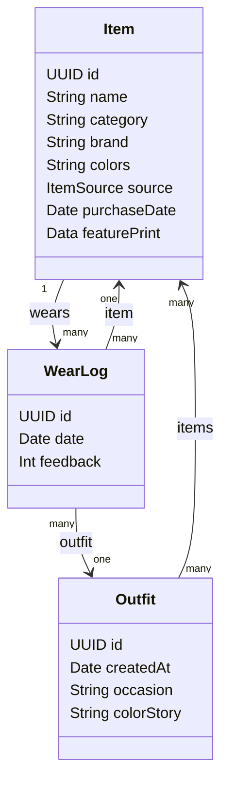
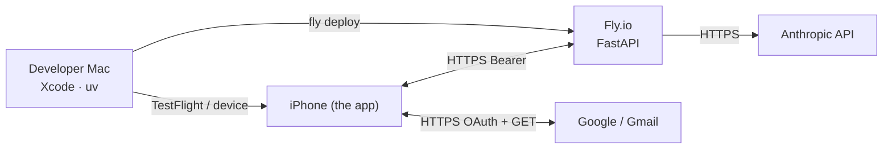

# Architecture

Wardrobe Stylist is a **local-first, privacy-first** personal app. Almost everything
happens on the iPhone; a thin stateless backend exists only to hold the Anthropic API key
and call Claude. This document explains the components, the data flows, and how the
**read-only Gmail** and **hybrid-privacy** guarantees are realized.

- [System overview](#system-overview)
- [Privacy & trust boundaries](#privacy--trust-boundaries)
- [Receipt extraction pipeline](#receipt-extraction-pipeline-gmail--catalog)
- [Daily recommendation flow](#daily-recommendation-flow)
- [Data model](#data-model)
- [Read-only Gmail guarantee](#read-only-gmail-guarantee)
- [Tech stack](#tech-stack)
- [Deployment topology](#deployment-topology)

## System overview

Three actors: the **iPhone** (does the real work), **Google** (OAuth + read-only Gmail),
and a **stateless backend** that proxies to the **Anthropic API**.

**Key idea:** raw email never leaves the phone. On-device filtering reduces a mailbox to a
few candidate receipts, and only **minimal extracted text** (plus the occasional product
image) is sent to the backend. The backend keeps no email data.

## Privacy & trust boundaries

```mermaid
flowchart LR
    subgraph OnDevice["Stays on device"]
        direction TB
        Mail["Full email bodies"]
        Imgs["Item photos"]
        Cat["Catalog + wear history"]
        Tok["OAuth + device tokens (Keychain)"]
    end

    subgraph Leaves["Leaves device (minimized)"]
        direction TB
        Snip["Minimal receipt snippets"]
        Few["A few product/item images"]
        Attrs["Item attributes (ids, colors, categories)"]
    end

    OnDevice -->|on-device filtering| Leaves
    Leaves -->|HTTPS + Bearer| Backend["Backend (no persistence)"]
    Backend --> LLM["Claude (Anthropic)"]
```

| Data | Where it lives | Leaves device? |
|---|---|---|
| Full email bodies | Phone (transient, during sync) | ❌ never |
| OAuth + device tokens | Keychain | ❌ never |
| Catalog, images, wear history | SwiftData + on-disk | ❌ never (optional iCloud later) |
| Minimal receipt snippets | sent to backend → Claude | ✅ minimized |
| Item attributes for styling | sent to backend → Claude | ✅ ids + attributes |

## Receipt extraction pipeline (Gmail → catalog)

A tiered pipeline: deterministic and free on-device first, Claude only for the long tail.
See the design rationale in the plan — dedicated receipt parsers are the wrong tool for
*HTML order emails* and *fashion attributes*.

### Dedup

Ingestion dedups **catalog-wide** on a normalized `brand + name + category`
identity (scoped to email-sourced items), not per-email. One order often arrives
across several emails — an order confirmation *and* a dispatch email, sometimes
via a fulfiller like Global-e — each listing the same product; identity dedup
collapses them into a single catalog entry and keeps re-syncs idempotent. A sweep
at the start of each sync also heals any duplicates already in the store.

## Catalog browse (Phase 3)

The catalog UI reads the SwiftData store the pipeline populates — no backend
involved. Grouping, filtering, and sorting live in pure, unit-tested helpers
(`CatalogOrganizer`, `CatalogFilter`) so the SwiftUI views stay thin.

- **Dynamic categories** — sections are derived from the data; known fashion
  categories sort in a canonical order, unknown/blank ones (`uncategorized`)
  after, alphabetically.
- **Browse** — `CatalogView` shows an adaptive grid grouped by category with
  pinned headers; `.searchable` (name/brand), category filter chips, and a sort
  menu (recent / name / brand). Items are deletable via context menu and from the
  detail view (with confirmation).
- **Images** — `ItemThumbnail` renders a local image (Phase 4 photo capture) →
  the receipt's `imageURL` via `AsyncImage` → a category-symbol placeholder.
- **Detail** — `ItemDetailView`: brand, color swatches, material, purchase date,
  and source.

See [`ios/Wardrobe/Views/`](../ios/Wardrobe/Views).

## Manual photo capture (Phase 4)

Add items that never came from a receipt — photograph a garment (camera) or pick
one from the library (`PhotosPicker`), fill in a short form, and save it as a
`source = .photo` `Item`. `ImageProcessor` (pure UIKit) downscales to a bounded
full image + thumbnail stored on the item, so the same `ItemThumbnail` that
renders email items shows the real photo. Camera capture is device-only and
declares `NSCameraUsageDescription`; library picking needs no permission key.
Vision subject-lift / feature-print are intentionally out of scope here.

See [`ios/Wardrobe/Capture/`](../ios/Wardrobe/Capture).

## Daily recommendation flow

The stylist agent "Aria" runs on the backend as a tool-use loop (orchestrator + subagents),
returns a **structured** outfit, and never repeats recent looks.

## Data model

SwiftData models (optionals and collections noted in prose to keep the diagram readable).

- `Item.source` is `email | photo | manual`. `brand`, `subcategory`, `material`,
  `styleNotes`, `purchaseDate`, `sourceMsgId`, `imageURL`, image data, and
  `featurePrint` are optional. `imageURL` is the product image from the receipt,
  loaded on demand in the catalog (local image data, when present, takes priority).
- `colors` is `[String]`; images use `@Attribute(.externalStorage)`.
- `featurePrint` is an archived `VNFeaturePrintObservation` used for visual
  similarity/dedup (compare via `computeDistance(_:to:)`, not as a plain vector).

See [`ios/Wardrobe/Models/`](../ios/Wardrobe/Models).

## Read-only Gmail guarantee

Two independent layers (see [`docs/privacy.md`](privacy.md) and the guard test):

1. **Structural.** All Gmail traffic is expressed through
   [`GmailReadEndpoint`](../ios/Wardrobe/Gmail/GmailReadEndpoint.swift) — an enum whose
   every case is an HTTP **GET** to a read path. There is no case for any mutating
   operation, so a write request is *unrepresentable*. The only OAuth scope requested is
   `gmail.readonly` ([`GmailScope`](../ios/Wardrobe/Gmail/GmailScope.swift)).
2. **Test backstop.**
   [`GmailReadOnlyGuardTests`](../ios/WardrobeTests/GmailReadOnlyGuardTests.swift) asserts
   the scope set, that every endpoint is a GET on the allowlist, and scans the Gmail source
   directory for any mutating HTTP method or write path fragment. CI keeps it green.

## Tech stack

| Layer | Technology |
|---|---|
| iOS UI | SwiftUI (iOS 18 target, min 17) |
| Persistence | SwiftData; images via `.externalStorage` |
| Gmail auth | GoogleSignIn-iOS (scope `gmail.readonly`), tokens in Keychain |
| Gmail API | URLSession → read-only REST endpoints |
| On-device ML | Vision (subject lift, color, feature-print), Vision OCR |
| Context | WeatherKit, EventKit |
| Backend | FastAPI + Anthropic SDK (uv, ruff, mypy, pytest) |
| AI | Claude Haiku 4.5 / Sonnet 4.6 / Opus 4.7; tool use + prompt caching |
| Tests | Swift Testing, swift-snapshot-testing, pytest |
| CI | GitHub Actions (+ Xcode Cloud for TestFlight) |

## Deployment topology

- The backend stores secrets as Fly.io secrets (`ANTHROPIC_API_KEY`, `DEVICE_TOKEN`).
- The app stores only the user's OAuth tokens and the backend device token (Keychain).
