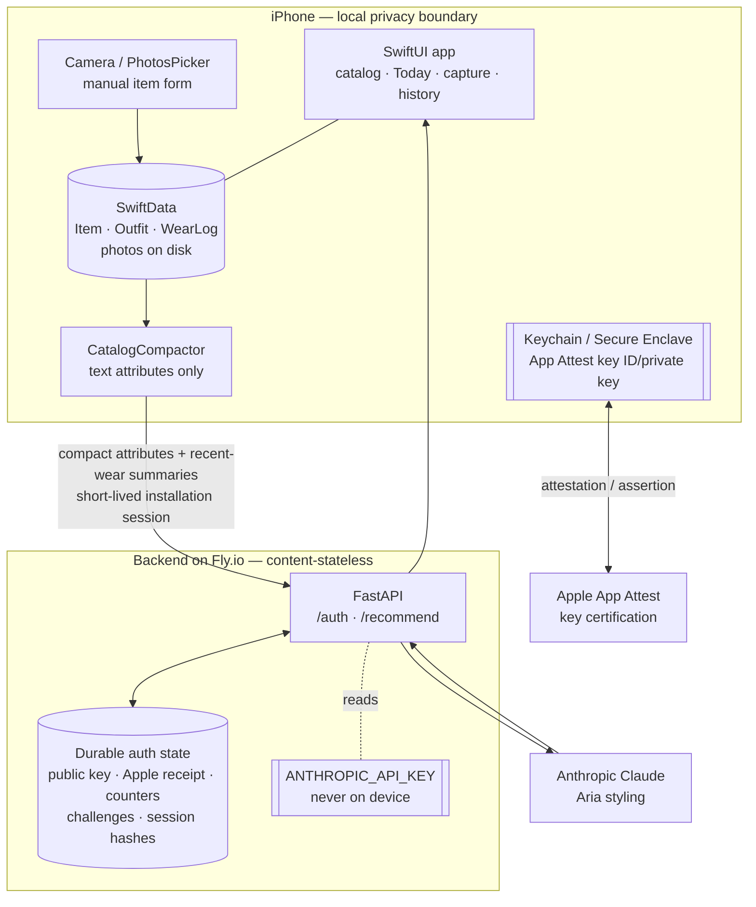
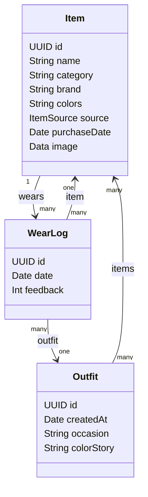
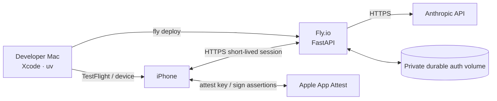

# Architecture

Wardrobe Stylist is a **local-first, privacy-first** personal app. Public v1 builds a wardrobe from
manual entries and user-selected photos, keeps the catalog on the iPhone, and offers optional AI
outfit styling. A thin, content-stateless backend holds the Anthropic API key and persists only the
minimum App Attest authentication/security metadata needed to authorize remote requests.

Public v1 does not connect to Google, read Gmail, import purchase receipts, or require a human
account. The earlier read-only Gmail/receipt-import implementation remains only in Git history and
explicitly historical setup documents; it is not part of the active v1 architecture.

- [System overview](#system-overview)
- [Privacy and trust boundaries](#privacy-and-trust-boundaries)
- [Anonymous backend authorization](#anonymous-backend-authorization)
- [Manual and photo catalog](#manual-and-photo-catalog)
- [Daily recommendation flow](#daily-recommendation-flow)
- [Data model](#data-model)
- [Tech stack](#tech-stack)
- [Deployment topology](#deployment-topology)
- [Build 4 clean-install transition](#build-4-clean-install-transition)
- [Historical Gmail implementation](#historical-gmail-implementation)

## System overview

The **iPhone** owns the wardrobe and user experience. **Apple App Attest** certifies one genuine
installation for optional connected styling. The developer backend proxies a minimized request to
the **Anthropic API** and keeps no wardrobe or model payload after request processing.

```mermaid
flowchart TB
    subgraph Device["iPhone — local privacy boundary"]
        UI["SwiftUI app<br/>catalog · Today · capture · history"]
        Store[("SwiftData<br/>Item · Outfit · WearLog<br/>photos on disk")]
        Capture["Camera / PhotosPicker<br/>manual item form"]
        Compact["CatalogCompactor<br/>text attributes only"]
        Keychain[["Keychain / Secure Enclave<br/>App Attest key ID/private key"]]
        Capture --> Store
        UI --- Store
        Store --> Compact
    end

    subgraph Cloud["Backend on Fly.io — content-stateless"]
        API["FastAPI<br/>/auth · /recommend"]
        AuthDB[("Durable auth state<br/>public key · Apple receipt · counters<br/>challenges · session hashes")]
        Key[["ANTHROPIC_API_KEY<br/>never on device"]]
        API <--> AuthDB
        API -. reads .- Key
    end

    Apple["Apple App Attest<br/>key certification"]
    Anthropic["Anthropic Claude<br/>Aria styling"]

    Keychain <-->|"attestation / assertion"| Apple
    Compact -->|"compact attributes + recent-wear summaries<br/>short-lived installation session"| API
    API --> Anthropic
    Anthropic --> API --> UI
```

## Privacy and trust boundaries

```mermaid
flowchart LR
    subgraph OnDevice["Stays on device"]
        direction TB
        Photos["Wardrobe photos"]
        Catalog["Catalog + outfits + wear history"]
        Purchase["Purchase details, when manually entered"]
        PrivateKey["App Attest private key"]
    end

    subgraph Leaves["Leaves device only for requested styling"]
        direction TB
        Attrs["Item IDs + compact text attributes"]
        Recent["Recent item IDs + bounded rating summaries"]
        Occasion["Optional occasion"]
        Proof["App Attest key ID / receipt / assertions<br/>anonymous short-lived session"]
    end

    OnDevice -->|"compaction / proof"| Leaves
    Leaves -->|"HTTPS"| Backend["Backend<br/>payloads transient"]
    Backend --> AuthStore[("Durable auth/security metadata only")]
    Backend --> LLM["Anthropic"]
```

| Data | Where it lives | Leaves device? |
|---|---|---|
| Catalog, photos, outfits, wear history | SwiftData + on-disk storage | No, except minimized styling fields below |
| Wardrobe photos | Device-local catalog | No in v1 styling |
| Purchase date/price/currency, if entered | Device-local catalog | No in v1 styling |
| App Attest private key | Secure Enclave | Never extractable |
| App Attest key ID, opaque Apple attestation receipt, counters and session metadata | Keychain + backend auth store | Yes, security/authorization only |
| Compact item attributes and recent-wear summaries | Backend → Anthropic for a requested suggestion | Yes, request lifetime only in the developer application |
| Optional occasion | Backend → Anthropic for that request | Yes |

The anonymous installation identifier is not a Wardrobe, Apple, or Google account. It survives
normal app updates but is recreated after reinstall, migration, or restore. The approved retention,
deletion, logging, and snapshot requirements live in the
[APP-009 data lifecycle and logging policy](app-store/app-attest-data-lifecycle-policy.md). Its
compliance table distinguishes verified controls from open external evidence; architecture text
must not turn an unchecked target into a production claim.

## Anonymous backend authorization

Remote AI uses App Attest-backed, short-lived sessions without a login screen:

```mermaid
sequenceDiagram
    participant App as iOS app
    participant Apple as Apple App Attest
    participant API as Wardrobe backend
    participant DB as Durable auth store

    App->>API: Request one-time attestation challenge
    App->>Apple: Generate key; attest SHA256(challenge)
    Apple-->>App: Attestation object
    App->>API: Key ID + attestation object
    API->>API: Verify Apple chain, nonce, RP ID,<br/>environment and counter; iOS 27+ category/build
    API->>DB: Store public key + receipt + installation metadata
    API-->>App: Short-lived bearer session
    Note over App,API: Later, after expiry
    App->>API: Request assertion challenge
    App->>Apple: Sign canonical client data
    App->>API: Assertion + exact client data
    API->>DB: Atomically consume challenge and advance counter
    API-->>App: New short-lived bearer session
```

The production verifier requires the exact registered App ID prefix + bundle ID, App Attest
environment, key binding, nonce/signature, and monotonic counter. On iOS 27+, Apple appends signed
validation-category and bundle-version extensions; when present, both must match the configured
distribution categories (`2` TestFlight, `4` App Store) and explicit build allowlist. Their signed
absence is accepted for supported iOS 18–26 clients. Challenges are randomized, expiring,
purpose-bound, and single-use; counters advance atomically.

App Attest is a physical-device boundary. Simulator tests use an injected fake. If
`DCAppAttestService.isSupported` is false—or secure verification is offline—the app keeps the
local wardrobe and offline Demo Mode usable but does not mint an unauthenticated remote-AI
session.

## Manual and photo catalog

Users add an item manually, photograph a garment, or choose a photo with `PhotosPicker`, then
complete a bounded details form. `ImageProcessor` downscales the selected image and thumbnail for
device-local storage. The catalog UI reads SwiftData directly; no backend is involved.

- **Dynamic categories** derive sections from the stored items.
- **Browse** supports search, category filters, recent/name/brand sorting, favorites, archive, and
  deliberate deletion.
- **Images** prefer local photo data and otherwise show a category placeholder.
- **Detail/edit** exposes the item's user-entered attributes and validation errors.
- **History** stores accepted outfits and wear logs locally for anti-repeat behavior.

See [`ios/Wardrobe/Capture/`](../ios/Wardrobe/Capture),
[`ios/Wardrobe/Views/`](../ios/Wardrobe/Views), and
[`ios/Wardrobe/Models/`](../ios/Wardrobe/Models).

## Daily recommendation flow

The stylist agent **Aria** proposes a wearable, non-repeating outfit from the user's own catalog.
Public v1 uses one Claude Opus 4.8 call with a forced `propose_outfit` tool. The app sends only a
compact, text-only snapshot—item IDs and selected attributes, not images—plus recent-worn IDs,
bounded rating summaries, and an optional occasion. The backend does not persist that payload.

```mermaid
sequenceDiagram
    actor User
    participant App as iOS app
    participant API as FastAPI /recommend
    participant Aria as Claude Opus 4.8 — Aria

    User->>App: Request a suggestion in Today
    App->>App: Compact catalog + recent-worn summaries
    App->>API: POST /recommend (short-lived App Attest session)
    API->>Aria: propose_outfit (forced tool · cached rubric)
    Aria-->>API: Outfit + alternates + rationale
    API->>API: Reject any ID absent from submitted catalog
    API-->>App: Validated suggestion
    App->>App: Resolve IDs to local items; render look
    User->>App: Wear this
    App->>App: Persist Outfit + WearLog
```

On device, `CatalogCompactor` builds the request, `WearHistory` derives recent-worn data, and
`OutfitRecommender` resolves returned IDs back to `Item`s. “Show me another” cycles returned
alternates without another network call. Weather, calendar context, and multi-agent composition
are deferred.

## Data model

```mermaid
classDiagram
    class Item {
        UUID id
        String name
        String category
        String brand
        String colors
        ItemSource source
        Date purchaseDate
        Data image
    }
    class Outfit {
        UUID id
        Date createdAt
        String occasion
        String colorStory
    }
    class WearLog {
        UUID id
        Date date
        Int feedback
    }
    Item "1" --> "many" WearLog : wears
    Outfit "many" --> "many" Item : items
    WearLog "many" --> "one" Item : item
    WearLog "many" --> "one" Outfit : outfit
```

The v1 schema contains only device-local `Item`, `Outfit`, and `WearLog` models; `ItemSource` is
`manual | photo`. Build 4 intentionally does not link the earlier Gmail/account-owned schemas into
the target and does not perform an in-place migration from builds 1–3.

## Tech stack

| Layer | Technology |
|---|---|
| iOS UI | SwiftUI (iOS 18 deployment target) |
| Persistence | SwiftData; images via `.externalStorage` |
| Backend auth | DeviceCheck App Attest + short-lived anonymous installation sessions |
| Capture | UIKit camera bridge + PhotosPicker |
| On-device image work | UIKit/Vision where supported; device-bound paths are gated in tests |
| Backend | FastAPI + Anthropic SDK (uv, Ruff, mypy, pytest) |
| AI | Claude Opus 4.8 stylist “Aria”; tool use + prompt caching |
| Tests | Swift Testing, UI tests, pytest, request-capture and release-artifact guards |
| CI | GitHub Actions |

## Deployment topology

```mermaid
flowchart LR
    Dev["Developer Mac<br/>Xcode · uv"] -->|"TestFlight / device"| Phone["iPhone"]
    Dev -->|"fly deploy"| Fly["Fly.io<br/>FastAPI"]
    Phone <-->|"HTTPS short-lived session"| Fly
    Fly -->|"HTTPS"| Anthropic["Anthropic API"]
    Phone <-->|"attest key / sign assertions"| Apple["Apple App Attest"]
    Fly <--> AuthDB[("Private durable auth volume")]
```

- Fly secrets hold `ANTHROPIC_API_KEY` and the App Attest session-signing secret. A shared
  `DEVICE_TOKEN` is not an acceptable public-client credential or rollback mechanism.
- The durable auth store contains Apple-certified public keys, opaque Apple attestation receipts,
  anonymous installation IDs, assertion counters, one-time challenges, hashed short-lived
  sessions, and coarse rate windows. It contains no wardrobe, prompt, or recommendation payload.
- Backend auth state, logs, snapshots, deletion, and manual operations follow the
  [APP-009 lifecycle policy](app-store/app-attest-data-lifecycle-policy.md). Fly's fixed seven-day
  customer-visible stream and undisclosed provider-internal in-service retention are accepted and
  publicly disclosed. Snapshot-list expiry and deletion-specific recovery evidence remain open.
- Public v1 has no Google OAuth dependency or Gmail network route.

## Build 4 clean-install transition

Build `1.0.0 (4)` is intentionally fresh-install-only. The owner approved discarding the local
wardrobe from TestFlight builds 1–3 and adding items again. Never install build 4 over an earlier
build.

On the earlier build, complete this sequence in order:

1. **Disconnect Google** and wait for the app to report success.
2. **Delete Server Security Data** and wait for the fresh App Attest deletion to report success.
3. Uninstall Wardrobe Stylist. This deletes the earlier device-local wardrobe.
4. Install build 4 as a clean app and enroll its new anonymous App Attest installation.

The first two actions cannot be recovered after uninstall because the Gmail-free app no longer has
the Google client and App Attest reinstall creates a different anonymous installation. Release QA
must retain the successful pre-uninstall checks and must not claim upgrade or migration support.

## Historical Gmail implementation

Earlier internal builds implemented optional, GET-only Gmail receipt import, on-device candidate
filtering, `/extract`, and background receipt sync. Those product paths, schemas, dependencies,
configuration values, and backend route are removed from active v1 source.

The historical design remains subject to a strict no-write rule until removed. Reintroducing it in
a later release would require a fresh product/privacy review, Google restricted-scope work as
applicable, updated public pages and App Privacy answers, archive checks, and a new TestFlight
candidate. See [`google-setup.md`](google-setup.md) and
[`gcp-oauth-production-sequence.md`](gcp-oauth-production-sequence.md) for historical context only.
