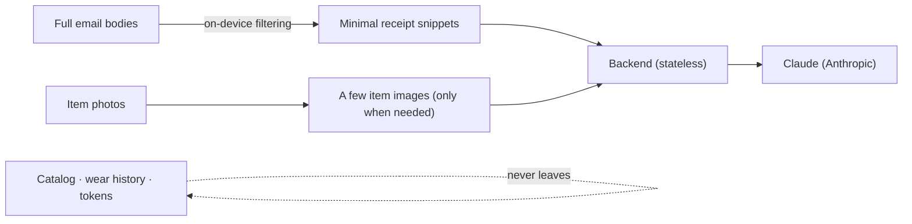

# Privacy & the read-only Gmail guarantee

This app is **personal and privacy-first**. Two promises drive the design: Gmail access is
**strictly read-only**, and your data stays **on your device** as much as possible (hybrid
privacy). This document explains both and how they're enforced.

## Read-only Gmail — guaranteed two ways

**1. Structural (writes are unrepresentable).**
All Gmail traffic is expressed through the
[`GmailReadEndpoint`](../ios/Wardrobe/Gmail/GmailReadEndpoint.swift) enum. Every case is an
HTTP **GET** against a read endpoint, and there is **no case** for any mutating operation
(send, insert, import, modify, batchModify, trash, untrash, delete, batchDelete, drafts,
label writes, settings writes). Since the rest of the app can only build requests from this
enum, a write request cannot be constructed. The only OAuth scope requested is
`gmail.readonly` ([`GmailScope`](../ios/Wardrobe/Gmail/GmailScope.swift)).

**2. Test backstop (CI-enforced).**
[`GmailReadOnlyGuardTests`](../ios/WardrobeTests/GmailReadOnlyGuardTests.swift):
- asserts the requested scope set is exactly `["…/auth/gmail.readonly"]`;
- asserts every `GmailReadEndpoint` is a GET on the read allowlist and contains no write path
  fragment;
- scans the `ios/Wardrobe/Gmail/` source directory and fails the build if any mutating HTTP
  method or Gmail write path fragment appears.

If anyone ever adds a write capability, the build goes red. (The write-capable Gmail tools
that exist in some developer tooling are deliberately **not** used by this app.)

## Hybrid privacy — what stays vs. what leaves

| Data | Where it lives | Leaves device? |
|---|---|---|
| Full email bodies | phone, transient during sync | ❌ never |
| OAuth tokens, backend device token | iOS Keychain | ❌ never |
| Catalog, item images, wear history | SwiftData + on-disk | ❌ never (optional iCloud later, your account) |
| Minimal receipt text snippets | → backend → Claude | ✅ minimized |
| Item attributes / a few images for styling | → backend → Claude | ✅ minimized |

The backend is a **stateless proxy**: it holds the Anthropic key and forwards requests, but
**does not persist** email content. See [`architecture.md`](architecture.md).

## Your controls

- **Sign out / revoke:** in-app sign-out clears Keychain tokens; revoke Google access at
  <https://myaccount.google.com/permissions>.
- **Delete data:** the catalog is local — deleting the app removes it (export/delete controls
  arrive in Phase 6).
- **Spend control:** set an Anthropic budget alert.

## Secrets hygiene

- The Anthropic key is **only** on the backend (`.env` locally, Fly.io secret in prod) — never
  in the app binary.
- `.env`, OAuth client secrets, and credential files are gitignored.
