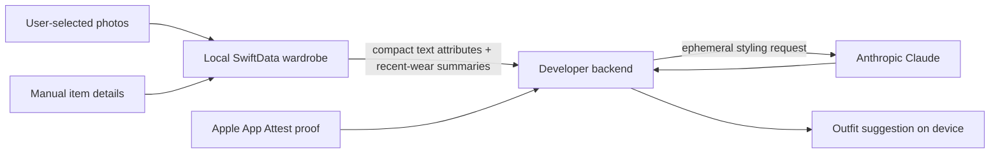

# Privacy architecture for the Gmail-free v1 candidate

This document describes the approved public-v1 architecture. It is not the hosted public privacy
policy; the publication source is
[`app-store/privacy-policy-draft.md`](app-store/privacy-policy-draft.md).

The earlier read-only Gmail and purchase-receipt import subsystem remains only in Git history and
explicitly historical setup documents. It is not reachable, configured, bundled, or described as
a feature in public v1.

## Public-v1 data flow

```mermaid
flowchart LR
    Photos["User-selected photos"] --> Catalog["Local SwiftData wardrobe"]
    Manual["Manual item details"] --> Catalog
    Catalog -->|"compact text attributes + recent-wear summaries"| API["Developer backend"]
    AppAttest["Apple App Attest proof"] --> API
    API -->|"ephemeral styling request"| Claude["Anthropic Claude"]
    Claude --> API --> Device["Outfit suggestion on device"]
```

The release contract is:

- manual and photo cataloging, browse/edit/history, local reminders, and Demo Mode do not require
  Google, a Wardrobe account, or the developer backend;
- Google Sign-In, Gmail permissions, receipt import, and receipt background sync are absent from
  the signed public-v1 archive;
- AI styling is optional, explicit-action-only, and protected by a short-lived anonymous App
  Attest session;
- styling sends compact text attributes, recent item IDs, bounded per-item rating summaries, and
  an optional occasion; it does not send wardrobe photos, purchase metadata, wear dates, or free-
  text feedback;
- the developer application does not persist wardrobe, prompt, or model-response payloads after
  request processing; and
- catalog data, selected photos, outfits, and wear history remain on device unless a future
  backup/sync feature is separately designed, disclosed, and enabled.

The current release work and remaining blockers are tracked in
[`app-release-backlog.md`](app-release-backlog.md).

## Anonymous backend authorization

Remote AI uses App Attest rather than a human login. One installation enrolls an Apple-certified
key and receives short-lived sessions renewed with fresh, one-time assertion challenges. The
private key stays in the Secure Enclave. The anonymous installation identifier is not a Wardrobe,
Google, or Apple user account and is recreated after reinstall, migration, or restore.

If App Attest is unsupported or secure verification is unavailable, the app fails closed for
remote AI while keeping the local wardrobe and offline Demo Mode usable. There is no shared client
bearer and no unauthenticated remote-AI fallback.

## Backend authentication-data lifecycle

The approved source of truth is
[`app-attest-data-lifecycle-policy.md`](app-store/app-attest-data-lifecycle-policy.md). Its main
limits are:

- request and response payloads are not persisted by the developer application;
- challenges, session hashes, and rate-window HMACs have short fixed validity and must be purged
  within 70, 20, and at most 65 minutes respectively;
- active anonymous installation metadata and its opaque, untrusted Apple attestation receipt
  expire after 90 days without successful authenticated use; revoked records expire after 30 days;
- a verified server-data deletion removes live authentication state synchronously, within the
  policy's 24-hour maximum;
- encrypted auth snapshots are configured to disappear from Fly's customer listing within 14
  days, while provider all-copy purge timing remains undisclosed;
- application access logs are disabled and developer-emitted payload-free security events may
  last at most seven days;
- Fly's customer-visible proxy/platform records last seven days and may include paths, request
  IDs, or client IP; and
- separate provider operational/abuse logs may include source IP with no published or customer-
  enforceable in-service maximum; the owner accepted that provider boundary on 2026-08-19.

Fly Security summarized optional DPA termination periods of 30 days for personal-data deletion and
90 days for residual encrypted backups. The account's Compliance page says that agreement becomes
active only when the customer signs it; no active DPA or exact version is currently evidenced, and
those periods must not be represented as active-service log or snapshot guarantees.

The repository deploys application-owned cleanup, deletion, SQLite/WAL maintenance, persistence
guards, payload-free logging guards, and a no-access-log production command. On 2026-08-20 the
owner approved payload-free manual operations before archive/upload, after each backend or
production-configuration change, and at least every 30 days while production remains deployed or
enabled. Snapshot-list expiry, deletion-specific restore/non-return, App Privacy, the build-7 signed
archive/distribution pipeline, and clean physical Dark Mode visual retest remain release gates. The
2026-08-28 assessment confirmed that build 6 fails that visual gate and is non-promotable; PR #31
has since merged and verified the replacement implementation. A signed-in TestFlight **Build
Uploads** inspection on 2026-08-29 showed build 6 as the highest upload and **Complete**, with build
7 absent. Build `1.0.0 (7)` is selected with `MARKETING_VERSION = 1.0.0`, and source configuration is
prepared for accepted builds `4,5,6,7`. The exact merged Linux/AMD64 backend deployed as completed
Fly v10 with the targeted auth-service INFO logger and production TestFlight allowlist for builds
`4,5,6,7`; the required post-change review passed on 2026-08-29. Its predecessor v8
payload-free post-change review passed at `2026-08-21T11:09:20Z`, and the fresh build-5 post-
distribution review passed from
`2026-08-22T03:19:20Z` through `03:30:33Z`. The first bounded query was zero because no lifecycle
flow had yet been exercised. Later physical flows observed bounded registration and assertion
successes from clean build 5 and exactly one deletion success during the build-4 identity-safe
handoff. Protected `/recommend` remains aggregate/client-evidenced. Build 5 then crashed when its
delivered local notification was tapped and is non-promotable. Build 5's identity-safe handoff and
clean build-6 QA through the fixed notification tap later passed. Build 6's final identity-safe
deletion/reinstall and new anonymous enrollment completed on 2026-08-28 using only aggregate and
bounded-marker evidence. The required v9 post-deploy/pre-upload payload-free review was missed and
is not backdated; a late full
review passed at `2026-08-23T02:13:12Z`, restoring current operational evidence while retaining the
process defect.

## Data inventory

The source-of-truth inventory is
[`app-store/app-privacy-data-inventory.md`](app-store/app-privacy-data-inventory.md). It records
what originates on device, what reaches the developer backend and Anthropic, the purpose, storage
expectation, consent gate, deletion path, and unresolved provider-contract questions.

Do not publish claims such as “Anthropic never retains data” or “data is never used for training”
until the production contract/configuration has been verified. Do not turn a repository control or
accepted provider unknown into a stronger production guarantee.

## User controls required for release

- **Withdraw styling consent:** stop wardrobe-attribute transmission for recommendations.
- **Disable reminders:** cancel pending local notifications.
- **Delete local wardrobe data:** remove items, photos, outfits, wear logs, cached looks, and
  related device preferences without changing the separate server record.
- **Delete server security data:** use a fresh App Attest deletion assertion to remove this
  installation's live anonymous authentication record and sessions without deleting the local
  wardrobe. Future remote-AI use enrolls a new anonymous identity.

Each control must report success only after its operation completes. Destructive actions require
specific confirmation, and a failure must never be presented as deletion success.

## Build 4 through build 6 privacy transition

Build `1.0.0 (4)` is fresh-install-only. The owner approved discarding the earlier device-local
wardrobe and adding items again. The installed development build completed Google disconnection
and local deletion, but predated the server-deletion UI; a read-only aggregate production check
found zero installations, zero sessions, and zero pending challenges before it was uninstalled.
Build 4 was later installed only from processed TestFlight and never over the older app; do not
claim an in-place migration.

The ordering mattered because uninstall removed local data and the old Google client. The clean
build-4 install created one anonymous production App Attest identity from that zero baseline. First
and cold-renewal protected calls succeeded on iPhone 16 Pro/iOS 26.6, with expected signed runtime-
field absence. An eligible automatic snapshot created at `2026-08-22T07:33:23Z` later reported
`created` with 14-day retention. Build 4's proof of possession remained available after build 5
appeared installed in place unexpectedly. While that inherited identity was still installed, **Delete Server
Security Data** produced exactly one bounded success marker and live installations, sessions, and
challenges reached `0/0/0`. The owner then deleted local data, deleted the app, and installed build
5 cleanly. This is identity-safe deletion evidence, not migration support. Actual snapshot-list
expiry and deletion-specific restore/non-return remain open.

Physical QA also found that a failed offline Restyle hid an otherwise persisted cached look until
relaunch/tap. Build 4 is not promotable. Build 5 was selected after App Store Connect showed build
4 highest. Its local pre-archive regression, including Release simulator/artifact privacy
guards, is green. App Store Connect still showed build 4 highest at `2026-08-22T01:09:39Z`; the
final pre-validation refresh at `2026-08-22T03:16:16Z` again showed builds 1–4 only and build 5
absent. The production-signed build-5 archive passed strict profile, scalar production App Attest,
privacy manifest, public configuration, Gmail-free absence, and separate non-emitting credential
checks. Xcode validation succeeded at `03:18:30Z` and normal App Store Connect upload succeeded at
`03:20:59Z`, each with zero errors, warnings, or informational messages. Processing reached
**Ready to Submit** by `03:24:21Z`; processed metadata retained production App Attest,
`get-task-allow = false`, beta reporting, included symbols, and no non-exempt encryption. Exactly
the `Family` Internal Testing group is assigned, with one tester and no individual assignments.
Build 5 is consumed. Its clean first launch showed no login and an empty wardrobe; offline Demo
Mode, Camera and Photo Library saves, and the full local catalog flow passed. Online Style at
`16:30` registered a new anonymous identity and cached relaunch passed. Restyle at `17:04` exercised
assertion renewal; a failed offline Restyle preserved the cached look; offline Wear this/History
passed; and the local reminder delivered. The bounded v8 stream observed registration and assertion
success markers. Tapping the delivered reminder at `2026-08-22T17:15:14+08:00` crashed. The exact
build-5 dSYM matched; safe symbolication identified `SIGABRT`, a UIKit state-restoration assertion,
and an app frame in the `DailyReminderNotificationRouter` `didReceive` async bridge. Build 5 is
therefore non-promotable. Do not repeat the tap. It remained installed with its live identity intact
until the later eligible identity-safe handoff completed.

The notification-router fix merged through PR #27. Focused tests passed 17/17; merged-source
verification retained 221 backend tests plus the locked audit/security/type gates, 231/231 iOS
tests, and all 43 release-script tests. Historical Fly v9 was compatible with accepted builds
`4,5,6`; the exact
production-signed `1.0.0 (6)` archive passed strict privacy, signing, production App Attest, public-
configuration, and Gmail-free checks, then completed normal-route validation/upload, Apple
processing, and `Family` Internal Testing assignment.

Build 6 first appeared installed in place before the planned build-5 handoff, but inherited proof
of possession remained available. After the successful `2026-08-23T07:34:23Z` automatic snapshot
was confirmed post-enrollment with 14-day retention, server deletion returned live aggregates to
`0/0/0`; local data and the app were deleted; and build 6 was installed cleanly. This is deletion
evidence, not migration support. Clean build-6 QA then passed Gmail-free launch, offline Demo and
local catalog/media flows, production registration and cold assertion renewal, explicit cached-
look restoration after offline relaunch, failed-Restyle preservation, Wear/History, and delivered-
reminder tap without a crash or local-state loss.

The eligible automatic snapshot at `2026-08-25T07:35:53Z` reported `created` with 14-day retention.
Before the owner-controlled server deletion, the installation/session/challenge aggregate was
`1/0/0`. Deletion produced exactly one bounded marker; post-deletion and post-uninstall aggregates
were `0/0/0`. Clean reinstall, first launch, local item additions, and styling consent alone kept the
zero baseline. Explicit Style at `2026-08-28 17:17 SGT` created one new anonymous installation and
active session, with zero pending or failed challenges, one completed challenge, and one bounded
registration marker. Signed runtime fields were absent as expected on iOS 26.6; this does not prove
iOS 27+ category/build enforcement. No identifiers, raw logs, or payloads were retained. This closes
deletion/reinstall/new enrollment only. Snapshot-list expiry and deletion-specific restore/non-return
remain open. Separately, the 2026-08-28 owner-supplied Dark Mode screenshot confirms that build 6's
**Allow AI styling** title is approximately 21 points right of the button center and that the sampled
`#C2DFFC` fill against the white title is approximately `1.38:1`. Build 6 is therefore non-promotable;
its completed identity and notification evidence remains valid. The 2026-08-29 signed-in Build
Uploads check showed build 6 highest and **Complete**, with build 7 absent, selecting `1.0.0 (7)`
while keeping `MARKETING_VERSION = 1.0.0`.

- [x] Complete and verify the replacement control implementation. PR #31 rebase-merged app commit
  `b7e46e4` to clean `main` `e4a0ae2`. The title-only control is centered, full-width, and opaque;
  enabled/pressed/disabled contrast coverage and the screenshot UI assertion passed. Merged
  verification retained 221 backend tests plus audit/Bandit/Ruff/mypy, 226 Swift unit tests, all
  9 UI tests, and 43 release-script tests; both GitHub iOS checks are green.
- [x] Prepare the selected build-7 source configuration without claiming deployment. Source records
  `CURRENT_PROJECT_VERSION = 7` and accepted builds `4,5,6,7`; Fly v9 still accepted `4,5,6` at
  selection time.
- [x] Deploy and review the exact build-7 backend. Fly v10 now accepts `4,5,6,7`; exact image,
  health/configuration/storage/snapshot, and payload-free review passed on 2026-08-29.
- [x] Complete the build-7 exact-source regression. Clean synchronized main
  `f183f074d1a63a4ec46d6d34fa13979a2c8b1fdd` passed 222 backend tests plus
  audit/Bandit/Ruff/mypy, 226 Swift unit tests, all 9 UI tests, 43 release-script tests, and the
  Release simulator/artifact gates.
- [ ] Repeat the full operations/recovery review immediately before archive, create and strictly
  verify the signed archive, refresh App Store Connect, repeat the review immediately before upload,
  obtain explicit owner approval, then complete normal-route validation/upload, processing,
  `Family` assignment, and the truthful tester-note gates.
- [ ] Clean-install processed build 7 and physically retest title centering, icon-slot
  absence, and enabled/pressed/disabled Dark Mode legibility before promotion.

## Secrets and release boundaries

- The Anthropic API key lives only in backend environment/Fly secrets.
- A public iOS app cannot keep a shared backend credential secret, whether it is in `Info.plist`,
  source, an asset, or Keychain.
- Release artifacts must prove the production backend and public links are HTTPS, the App Attest
  entitlement/profile matches the registered App ID, the app and integrated SDK privacy manifests
  are present, and the legacy shared bearer is absent.
- The Gmail-free v1 archive must additionally prove that Google Sign-In frameworks, Google client
  identifiers/callback schemes, Gmail permissions/hosts, receipt-import client paths, and receipt
  background-task identifiers are absent.

## Deferred historical Gmail work

[`google-setup.md`](google-setup.md) and
[`gcp-oauth-production-sequence.md`](gcp-oauth-production-sequence.md) record the removed read-only
Gmail design. They are not public-v1 setup steps or release gates. Reintroducing Gmail later would
require a new product decision, implementation/privacy review, accurate public pages and App
Privacy answers, Google restricted-scope verification as applicable, a new candidate build, and
complete regression evidence.
