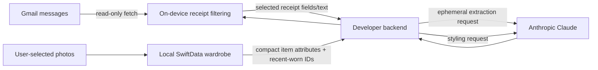

# Privacy architecture and the read-only Gmail guarantee

This document describes the implementation in this repository. It is not the hosted public
privacy policy; the publication-ready source is
[`app-store/privacy-policy-draft.md`](app-store/privacy-policy-draft.md).

## Read-only Gmail — enforced two ways

**1. Structural: Gmail writes are not representable.**

All Gmail traffic is expressed through
[`GmailReadEndpoint`](../ios/Wardrobe/Gmail/GmailReadEndpoint.swift). Every case is an HTTP
`GET` against an allowlisted read endpoint. There are no cases for sending, drafting, labeling,
modifying, trashing, or deleting mail. The app requests exactly one Workspace scope:
`https://www.googleapis.com/auth/gmail.readonly`.

**2. Test backstop: CI rejects write capability.**

[`GmailReadOnlyGuardTests`](../ios/WardrobeTests/GmailReadOnlyGuardTests.swift) verifies the exact
scope, HTTP method, read endpoint allowlist, and Gmail source directory. Any mutating method,
scope, or path makes the test suite fail.

## Actual data flow

```mermaid
flowchart LR
    Gmail["Gmail messages"] -->|"read-only fetch"| Device["On-device receipt filtering"]
    Device -->|"selected receipt fields/text"| API["Developer backend"]
    API -->|"ephemeral extraction request"| Claude["Anthropic Claude"]
    Photos["User-selected photos"] --> Catalog["Local SwiftData wardrobe"]
    Catalog -->|"compact item attributes + recent-worn IDs"| API
    API -->|"styling request"| Claude
    Claude --> API --> Device
```

The intended public-release contract is:

- Gmail access is optional; the local photo/manual wardrobe works without Google authorization.
- Candidate detection and deterministic extraction run on device before cloud fallback.
- Cloud receipt processing and AI styling require separate, versioned, revocable consent.
- Background receipt import and daily reminders are separate opt-ins, off by default.
- The backend must not persist receipt content or wardrobe payloads beyond request processing.
- The app stores catalog, photos, outfits, and wear history locally unless the user later chooses
  an explicitly documented backup/sync feature.

The current public-release work and remaining blockers are tracked in
[`app-release-backlog.md`](app-release-backlog.md). Previous internal builds bundled a shared
backend bearer that was **not a secret**. The current client removes that credential and can use
remote AI only through anonymous, per-installation App Attest sessions. Apple provisioning,
durable Fly auth state, development-device verification, production cutover, and legacy retirement
are complete. Fly v5 now deploys the repository's lifecycle-policy enforcement. `APP-009` remains
open for external operations evidence, the signed archive, and production TestFlight proof.

## Backend authentication-data lifecycle

The approved source of truth is
[`app-attest-data-lifecycle-policy.md`](app-store/app-attest-data-lifecycle-policy.md). Its main
limits are:

- request payloads are not persisted by the developer application;
- challenges, session hashes, and rate-window HMACs have short fixed validity and must be purged
  within 70, 20, and at most 65 minutes respectively;
- active anonymous installation metadata and its opaque, untrusted Apple receipt expire after 90
  days without successful authenticated use; revoked records expire after 30 days;
- a verified server-data deletion removes live auth state within 24 hours;
- encrypted auth snapshots are configured to disappear from Fly's customer listing within 14
  days, while provider all-copy purge timing remains undisclosed;
- application access logs must be disabled and developer-emitted payload-free security events may
  last at most seven days;
- Fly's customer-visible proxy/platform records last seven days and may include paths, request IDs,
  or client IP; and
- separate provider operational/abuse logs may include source IP with no published or
  customer-enforceable in-service maximum; the owner explicitly accepted that provider boundary
  on 2026-08-19.

Fly Security summarized optional DPA termination periods of 30 days for personal-data deletion and
90 days for residual encrypted backups. The account's Compliance page says that agreement becomes
active only when the customer signs it; no active DPA or exact version is currently evidenced, and
those periods must not be represented as active-service log or snapshot guarantees.

The former 24-hour provider raw-IP maximum was not met and has been superseded for Fly-controlled
logging by the owner-approved disclosure above. This does not change the separate 24-hour live
server-deletion or temporary-restore-volume deadlines.

Fly v5 deploys the application-owned controls with a one-minute lifecycle task on the
minimum-one-Machine production topology, repeat-until-drained cleanup, 90/30-day installation
purges, synchronous fresh-assertion deletion, SQLite secure-delete/WAL maintenance, structural
persistence/logging guards, and a no-access-log container command. On 2026-08-20 the owner
approved payload-free manual operations before archive/upload, after each backend/configuration
change, and at least every 30 days while production remains deployed or enabled instead of adding
an automated monitoring processor for the initial personal single-user release. Monitored support
publication, snapshot-list expiry,
restore-after-deletion evidence, App Privacy publication, and the other unchecked policy items
remain release blockers.

## Data inventory

The source-of-truth inventory is
[`app-store/app-privacy-data-inventory.md`](app-store/app-privacy-data-inventory.md). It records
what originates on device, what reaches the developer backend and Anthropic, the purpose, storage
expectation, consent gate, deletion path, and unresolved provider-contract questions.

Do not publish claims such as “Anthropic never retains data” or “data is never used for training”
until the production contract/configuration has been verified. Do not treat the deployed
application controls as proof of the accepted-undisclosed provider boundary or the still-open
manual-review, support, restore, processor-contract, and publication requirements.

## User controls required for release

- **Sign out:** end the local Google session without deleting the wardrobe.
- **Disconnect Gmail:** revoke the Google authorization grant and stop Gmail access.
- **Withdraw receipt-analysis consent:** stop foreground/background receipt transmission.
- **Withdraw styling consent:** stop wardrobe-attribute transmission for recommendations.
- **Disable background import/reminders:** cancel pending work immediately.
- **Delete local wardrobe data:** remove items, photos, outfits, wear logs, sync state, cached looks,
  and account-scoped preferences, while leaving unrelated Google data untouched.
- **Delete server security data:** use a fresh App Attest deletion assertion to remove this
  installation's live anonymous authentication record and sessions, without deleting the local
  wardrobe or disconnecting Google. Future remote-AI use enrolls a new anonymous identity.

Each control must report success only after its operation completes. Destructive actions require
specific confirmation, and a failure must never be presented as deletion or revocation success.

## Secrets and release boundaries

- The Anthropic API key lives only in backend environment/Fly secrets.
- OAuth access/refresh tokens are managed by Google Sign In and platform credential storage.
- A public iOS app cannot keep a shared backend credential secret, whether it is in `Info.plist`,
  source, an asset, or Keychain. The production identity cutover is specified in
  [`gcp-oauth-production-sequence.md`](gcp-oauth-production-sequence.md).
- Release artifacts are checked for the pinned Google Sign In version, app and SDK privacy
  manifests, launch metadata, version fields, encryption declaration, HTTPS backend and public
  links, matching OAuth callback configuration, and absence of the legacy shared backend bearer.

## Policy constraints

Google Workspace Limited Use applies to raw and derived Gmail data. Apple requires clear
disclosure and permission before personal data is shared with third-party AI. Neither an App
Store privacy label nor a Google CASA assessment replaces the in-app disclosure, data
minimization, revocation/deletion controls, or processor-contract requirements.
