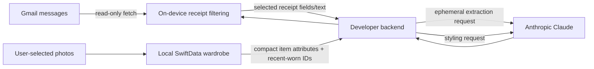

# Privacy architecture and the read-only Gmail guarantee

This document describes the implementation in this repository. It is not the hosted public
privacy policy; the publication-ready source is
[`app-store/privacy-policy-draft.md`](app-store/privacy-policy-draft.md).

## Read-only Gmail — enforced two ways

**1. Structural: Gmail writes are not representable.**

All Gmail traffic is expressed through
[`GmailReadEndpoint`](../ios/Wardrobe/Gmail/GmailReadEndpoint.swift). Every case is an HTTP
`GET` against an allowlisted read endpoint. There are no cases for sending, drafting, labeling,
modifying, trashing, or deleting mail. The app requests exactly one Workspace scope:
`https://www.googleapis.com/auth/gmail.readonly`.

**2. Test backstop: CI rejects write capability.**

[`GmailReadOnlyGuardTests`](../ios/WardrobeTests/GmailReadOnlyGuardTests.swift) verifies the exact
scope, HTTP method, read endpoint allowlist, and Gmail source directory. Any mutating method,
scope, or path makes the test suite fail.

## Actual data flow

```mermaid
flowchart LR
    Gmail["Gmail messages"] -->|"read-only fetch"| Device["On-device receipt filtering"]
    Device -->|"selected receipt fields/text"| API["Developer backend"]
    API -->|"ephemeral extraction request"| Claude["Anthropic Claude"]
    Photos["User-selected photos"] --> Catalog["Local SwiftData wardrobe"]
    Catalog -->|"compact item attributes + recent-worn IDs"| API
    API -->|"styling request"| Claude
    Claude --> API --> Device
```

The intended public-release contract is:

- Gmail access is optional; the local photo/manual wardrobe works without Google authorization.
- Candidate detection and deterministic extraction run on device before cloud fallback.
- Cloud receipt processing and AI styling require separate, versioned, revocable consent.
- Background receipt import and daily reminders are separate opt-ins, off by default.
- The backend must not persist receipt content or wardrobe payloads beyond request processing.
- The app stores catalog, photos, outfits, and wear history locally unless the user later chooses
  an explicitly documented backup/sync feature.

The current public-release work and remaining blockers are tracked in
[`app-release-backlog.md`](app-release-backlog.md). In particular, the existing internal-build
shared backend bearer is bundled in the client and is **not a secret**; it must be replaced by
short-lived per-user authorization before public distribution.

## Data inventory

The source-of-truth inventory is
[`app-store/app-privacy-data-inventory.md`](app-store/app-privacy-data-inventory.md). It records
what originates on device, what reaches the developer backend and Anthropic, the purpose, storage
expectation, consent gate, deletion path, and unresolved provider-contract questions.

Do not publish claims such as “Anthropic never retains data,” “data is never used for training,”
or a fixed deletion period until the production contract/configuration has been verified.

## User controls required for release

- **Sign out:** end the local Google session without deleting the wardrobe.
- **Disconnect Gmail:** revoke the Google authorization grant and stop Gmail access.
- **Withdraw receipt-analysis consent:** stop foreground/background receipt transmission.
- **Withdraw styling consent:** stop wardrobe-attribute transmission for recommendations.
- **Disable background import/reminders:** cancel pending work immediately.
- **Delete local wardrobe data:** remove items, photos, outfits, wear logs, sync state, cached looks,
  and account-scoped preferences, while leaving unrelated Google data untouched.

Each control must report success only after its operation completes. Destructive actions require
specific confirmation, and a failure must never be presented as deletion or revocation success.

## Secrets and release boundaries

- The Anthropic API key lives only in backend environment/Fly secrets.
- OAuth access/refresh tokens are managed by Google Sign In and platform credential storage.
- A public iOS app cannot keep a shared backend credential secret, whether it is in `Info.plist`,
  source, an asset, or Keychain. The production identity cutover is specified in
  [`gcp-oauth-production-sequence.md`](gcp-oauth-production-sequence.md).
- Release artifacts are checked for the pinned Google Sign In version, app and SDK privacy
  manifests, launch metadata, version fields, encryption declaration, HTTPS backend and public
  links, matching OAuth callback configuration, and absence of the legacy shared backend bearer.

## Policy constraints

Google Workspace Limited Use applies to raw and derived Gmail data. Apple requires clear
disclosure and permission before personal data is shared with third-party AI. Neither an App
Store privacy label nor a Google CASA assessment replaces the in-app disclosure, data
minimization, revocation/deletion controls, or processor-contract requirements.
